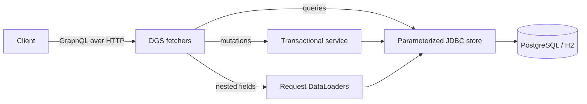
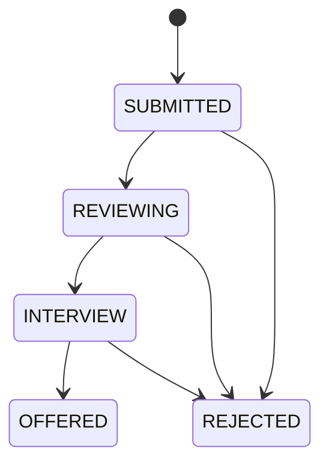

# Spring DGS Applications

A small, executable GraphQL portfolio project: browse jobs and candidates, apply to a job, and move applications through a hiring workflow.

**[Open the live browser demo](https://rcrespo808.github.io/spring-dgs-applications/)**

**[Read the application manual](docs/APPLICATION_MANUAL.md)**

The GitHub Pages playground executes real GraphQL operations with GraphQL.js against in-memory demo data. It shares the Java API's schema, but does not run Spring Boot, JDBC or DGS in the browser. Mutations last until the page reloads. The backend's batching, transactions and concurrency behavior are demonstrated by the Java implementation and tests.

All seeded companies and candidates are fictional. The browser playground uses local sample data; the Spring Boot service, database migrations, and integration tests are available in this repository.

## Run locally

With Java 21 and Maven 3.9+:

```sh
mvn verify
mvn spring-boot:run
```

Open [GraphiQL](http://localhost:8080/graphiql) and run the operations in [`examples/`](examples). The default H2 database needs no setup and resets when the process exits. Health is available at `/actuator/health`.

For persistent PostgreSQL, with Docker Compose:

```sh
docker compose up --build -d
docker compose logs -f api
```

The API binds to localhost. Use `PORT=8081 docker compose up --build -d` if port 8080 is occupied. `docker compose down` stops the services and keeps data; `docker compose down -v` also deletes the demo database.

## Try the API

```graphql
query {
  applications(limit: 20) {
    id
    status
    job { title company }
    candidate { name }
  }
}
```

```sh
curl http://localhost:8080/graphql \
  -H 'Content-Type: application/json' \
  --data '{"query":"{ applications { id status job { title } candidate { name } } }"}'
```

```graphql
mutation {
  applyToJob(input: { jobId: "job-2", candidateId: "candidate-3" }) {
    id
    status
  }
}
```

Submitting that application again produces `errors[].extensions.code: ALREADY_APPLIED`. Use the returned ID in `updateApplicationStatus`. Jobs and candidates are seeded read-only fixtures in this first version.

## What this demonstrates

| Concern | Implementation and evidence |
| --- | --- |
| Schema-first API | Explicit SDL, inputs, enums, nullability and nested fields |
| Netflix DGS | Annotated query, mutation and field fetchers |
| N+1 avoidance | Request-scoped mapped DataLoaders; one `IN` query per relationship type for a page |
| Selective fetching | Querying only application IDs performs no relationship lookups |
| SQL persistence | Spring JDBC, Flyway migrations, PostgreSQL; H2 for zero-setup exploration |
| Business rules | Transactional mutations, unique application constraint, explicit status transitions |
| Concurrent writes | Duplicate submission protection and compare-and-set status updates |
| Errors | Stable business error codes; internal exceptions logged without exposing SQL to clients |
| Pagination | Deterministic ID ordering, offset/limit, maximum 100 records per field |
| Verification | 11 HTTP/persistence integration tests, batching assertions and a concurrent duplicate test; verified locally on H2 and PostgreSQL |

## Architecture and tradeoffs



The loader batches related IDs and returns an ID-to-record map, so results do not depend on database row ordering. JDBC work runs synchronously on the servlet execution path; the completed future satisfies the DataLoader contract and does not make database access nonblocking.

With both nested fields selected, a page uses one application query, one job batch query and one candidate batch query. A test asserts one batch invocation for each relationship, including deduplication when two applications share a job. This guarantee concerns one application page, not an arbitrary operation with many aliases.

The schema keeps mutation results nullable so a business error can be returned at that field. A missing `application(id:)` returns null. Invalid enum values and missing required inputs are rejected by GraphQL validation before business logic runs.



OFFERED and REJECTED are terminal. A compare-and-set SQL update prevents an older status from overwriting a concurrent change. The unique `(job_id, candidate_id)` constraint also protects against simultaneous duplicate submissions.

Offset pagination keeps this starter small. UUID ordering is deterministic, not chronological; cursor pagination and creation timestamps would be sensible next additions.

## Continuous integration

[`docs/ci/verify.yml`](docs/ci/verify.yml) contains a GitHub Actions matrix for H2 and PostgreSQL. It is a template, not an active workflow: the publishing login lacked GitHub's `workflow` scope. To enable it, move it to `.github/workflows/verify.yml` using a login authorized to manage workflows. Both database configurations have passed the test suite locally.

## Browser demo development

With Node.js 22+, run `npm ci` followed by `npm run build:demo`. This bundles GraphQL.js, Lucide icons and the shared SDL into `docs/assets/app.js`. Commit the generated asset along with source changes; GitHub Pages serves the `docs/` directory from `main`. The demo requires no external CDN or backend. Its small in-memory resolvers mirror the starter workflow but do not substitute for backend integration tests.

## Scope and next steps

This is a local demo with no authentication or authorization. Any caller can view demo candidates and change applications. Do not load real candidate data or expose this service publicly. Demo credentials in Compose and CI are disposable examples.

Next increments: authenticated candidate/recruiter roles, authorization tests, query complexity and alias limits, cursor pagination, request tracing, and a deployment exercise. AWS, MongoDB, federation, subscriptions, load testing and production operations are not implemented. Dependency versions are pinned for reproducibility, not a claim of being the latest or security-audited.

## Demo walkthrough

1. Run a nested application query, then remove the nested fields to compare the response shape.
2. Run the duplicate application mutation twice and inspect the `ALREADY_APPLIED` response.
3. Advance an application through the workflow and try an invalid transition.
4. Use query variables to filter applications by status.
5. Review the DataLoader and integration-test sections in the [application manual](docs/APPLICATION_MANUAL.md).

## References

- [Netflix DGS documentation](https://netflix.github.io/dgs/)
- [DGS DataLoaders](https://netflix.github.io/dgs/data-loaders/)
- [GraphQL learn](https://graphql.org/learn/)

Stack: Java 21, Spring Boot 3.5.5, Netflix DGS 10.5.0, Maven, PostgreSQL 17.
