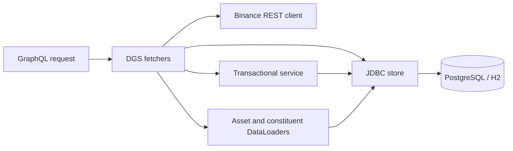

# MarketGraph Manual

MarketGraph combines live crypto quotes with a GraphQL workspace for exploring assets, trading pairs, currency conversions, and custom basket indices.

[Open MarketGraph](https://rcrespo808.github.io/spring-dgs-markets/) | [Source](https://github.com/rcrespo808/spring-dgs-markets)

## Data sources

| Surface | Source | Units and lifetime |
| --- | --- | --- |
| Binance spot panel | Public Binance mini-ticker WebSocket, REST fallback | USDT per crypto asset; updates during the session |
| `binancePrices` | Browser streaming cache or Java REST client | USDT; timestamps identify receipt time |
| Assets, pairs, conversions, indices | Editable synthetic reference model | USD anchor; browser edits reset on reload |
| Local Java reference model | PostgreSQL or H2 | PostgreSQL persists; default H2 resets on shutdown |

USDT and USD are distinct units. Live exchange quotes do not overwrite synthetic references. The market panel is read-only; the reference mutations change only the local model.

## Workspace

The top panel displays BTC/USDT, ETH/USDT, and SOL/USDT prices, rolling 24-hour percentage changes, and observation times. Sparklines show observations collected during the current browser session, not a historical chart.

The feed status reads **Live stream**, **REST snapshot**, or **Connecting / stale**. WebSocket reconnects use exponential backoff up to 30 seconds. When the stream is not healthy, REST is attempted every 15 seconds. Observations older than 30 seconds are marked stale and rejected by the live GraphQL query. A failed connection never substitutes synthetic prices.

Use the operation selector to load an example. Edit the query, open **Variables** for JSON input, and select **Run**. The response pane displays JSON data or structured errors. **Reset reference values** restores the model without interrupting the Binance feed.

## Live quotes

```graphql
query LiveSpot {
  binancePrices {
    symbol
    price
    quoteAsset
    change24h
    observedAt
    source
  }
}
```

`price` is the last traded spot price. `change24h` is a percentage, and `observedAt` is the time the application received the quote. `source` is `BINANCE_WEBSOCKET` or `BINANCE_REST`. Clicking Run takes a snapshot of the current data; the market panel continues streaming independently.

The Java endpoint uses bounded HTTP timeouts and caches successful responses for five seconds. After expiry, an upstream failure returns `FEED_UNAVAILABLE` rather than returning expired prices as current. Binance availability can depend on the network or region.

## Reference assets and pairs

```graphql
query ReferenceMarkets {
  assets { symbol name kind usdReference version }
  pairs {
    id
    base { symbol kind }
    quote { symbol kind }
    referenceRate
  }
}
```

`AssetKind` is `CRYPTO` or `FIAT`. Symbols are case-sensitive. Seeded assets are BTC, ETH, SOL, USD, EUR, and JPY. USD is fixed at one reference unit.

For a pair A/B, the rate is the number of B units per one A unit:

```text
rate(A/B) = usdReference(A) / usdReference(B)
```

With synthetic ETH = 3,000 USD and BTC = 60,000 USD, ETH/BTC = 0.05. Reversing the pair produces the reciprocal. These rates are derived relationships, not order-book quotes, and exclude spreads, fees, slippage, and liquidity.

`assets` and `pairs` use `limit` (default 20, maximum 100) and non-negative `offset`. Ordering is by symbol or pair ID. `assets(kind: CRYPTO)` filters the asset list.

## Conversions

```graphql
query Convert($amount: String!) {
  convert(from: "ETH", to: "BTC", amount: $amount) {
    from to amount rate result
  }
}
```

Variables:

```json
{ "amount": "2" }
```

The result is `0.100000000000` BTC at the initial references. No trade is submitted.

```text
result = amount * usdReference(from) / usdReference(to)
```

Decimal input is a string with at most 15 integer digits and 12 fractional digits. Negative amounts, scientific notation, and non-numeric strings are rejected; a zero conversion amount is valid. Java uses BigDecimal and the browser uses decimal.js. Results use 12 fractional places and half-even rounding. Conversion is computed at full intermediate precision before rounding once, independently of the displayed rounded rate.

## Basket indices

```graphql
query Baskets {
  indices {
    id name divisor valueUsd level
    constituents { asset { symbol usdReference } quantity }
  }
}
```

| Index | Fixed holdings | Divisor | Initial value / level |
| --- | --- | --- | --- |
| CRYPTO-2 / Crypto Duo | 0.01 BTC + 0.2 ETH | 12 | 1,200 USD / 100 points |
| FX-2 / Currency Basket | 50 EUR + 5,000 JPY | 0.9 | 90 USD / 100 points |

```text
basket value (USD) = sum(quantity * asset USD reference)
index level (points) = basket value / divisor
```

Quantities and divisors remain fixed; market-value weights drift as references change. These are custom fixed-holdings indices, not constantly rebalanced or market-cap-weighted indices. Levels use eight fractional places. The Java store computes all index valuations in a grouped SQL query; selected constituent details use batched loaders.

## Mutations

### Change a reference price

```graphql
mutation RevalueBitcoin {
  setReferencePrice(symbol: "BTC", usdReference: "66000", expectedVersion: 0) {
    symbol usdReference version
  }
}
```

From a fresh model, this increments BTC's version to 1 and changes Crypto Duo to 105 points. Rerun the index query to see the effect. ETH/BTC falls because one BTC now represents more reference value.

Each update requires the current `version`. Repeating the same mutation returns `CONFLICT`; reload the asset version before retrying. Prices must be positive and USD cannot be changed. Database updates compare the expected version atomically, preventing stale writes. The asset DataLoader cache is cleared for the changed symbol within the request.

### Add a trading pair

```graphql
mutation AddMarket {
  addPair(base: "SOL", quote: "EUR") {
    id referenceRate base { symbol } quote { symbol }
  }
}
```

Both assets must exist and differ. The pair ID is `SOL-EUR`. A database constraint rejects duplicate ordered pairs with `PAIR_EXISTS`. Adding a pair does not list a market on Binance.

## GraphQL architecture



The SDL is shared by Java DGS and browser GraphQL.js. Each pair's base, quote, and reference-rate fields reuse the request-scoped asset loader, batching shared symbols. Requesting pair IDs alone performs no asset lookups. Index constituent lists are also batched. JDBC calls are blocking; completed futures satisfy the loader interface without making SQL asynchronous.

The reference model is not a globally versioned market snapshot. Separate fields or requests can observe concurrent updates at different times. Reproducible historical analysis would require timestamped snapshots and a valuation date. This version has no return histories or correlation model; relationships are arithmetic cross rates and basket contributions.

## Error reference

| Code | Meaning |
| --- | --- |
| BAD_INPUT | Invalid decimal, pagination, version, same-asset pair, or USD edit |
| NOT_FOUND | Unknown asset symbol |
| PAIR_EXISTS | Ordered pair already exists |
| CONFLICT | Reference version changed |
| FEED_UNAVAILABLE | Binance data could not be fetched or is stale |
| INTERNAL_ERROR | Unexpected server failure |

Business codes appear under `errors[].extensions.code`. Nullable mutation and conversion results allow the affected field to return null with an error. Required inputs and enum values are validated by GraphQL before the resolver runs.

## Run and verify

```sh
docker compose up --build -d
```

Open [local GraphiQL](http://localhost:8080/graphiql). The service binds locally and has no authentication. PostgreSQL uses a dedicated `markets-data` volume. With Java 21 and Maven, `mvn spring-boot:run` uses an in-memory H2 database by default.

```sh
mvn verify
npm ci
npm test
npm run build:demo
```

Java tests cover decimal conversions, batching, normalized indices, reference propagation, concurrent edits, persistence, validation, and live-feed cache failures. Browser tests cover equivalent model calculations and Binance payload parsing. The optional CI template is [ci/verify.yml](ci/verify.yml).

Schema: [markets.graphqls](../src/main/resources/schema/markets.graphqls). Backend: [Java sources](../src/main/java/dev/rcrespo/markets). Browser model and feed: [demo](../demo). V1/V2 migrations are historical and unchanged; V3 adds market tables without deleting existing data.
