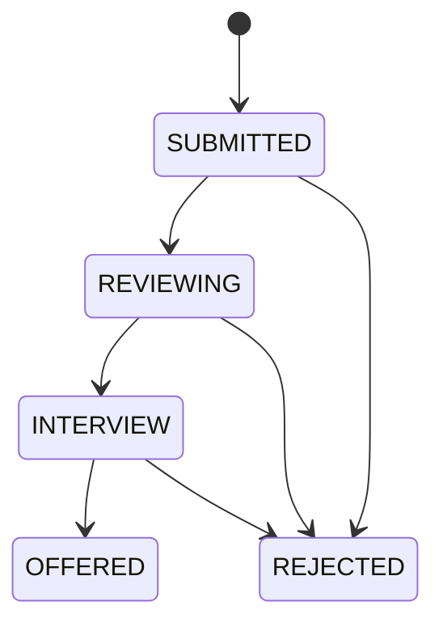
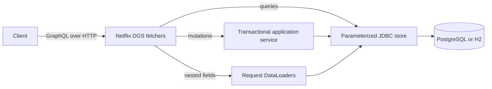

# Spring DGS Applications Manual

Spring DGS Applications is a GraphQL API for a simplified hiring workflow. It provides operations to browse jobs, candidates, and applications; submit an application; and move an application through review states.

The [live browser demo](https://rcrespo808.github.io/spring-dgs-applications/) is the quickest way to explore the API contract. The Spring Boot service is available locally through GraphiQL and Docker Compose.

## Quick Start

### Browser Demo

Open the [live browser demo](https://rcrespo808.github.io/spring-dgs-applications/). Select an operation, inspect or edit the GraphQL request, then select **Run**. The **Reset** control restores the sample data.

The playground runs the shared GraphQL schema against local sample data in the browser. Changes last until the page reloads.

### Local API

Run the service with Java 21 and Maven:

```sh
mvn verify
mvn spring-boot:run
```

Open [GraphiQL](http://localhost:8080/graphiql) and execute the example operations in [`examples/`](../examples).

To run the API with PostgreSQL:

```sh
docker compose up --build -d
docker compose logs -f api
```

The service listens on `http://localhost:8080`. Health is available at `GET /actuator/health`.

## Core Operations

### Browse Applications

Applications can include nested job and candidate fields. The client chooses the response shape.

```graphql
query BrowseApplications {
  applications(limit: 20) {
    id
    status
    job { id title company }
    candidate { id name }
  }
}
```

The `limit` range is `1..100`; `offset` must be non-negative. `applications` can also be filtered by status:

```graphql
query ApplicationsInReview($status: ApplicationStatus) {
  applications(status: $status) {
    id
    status
    candidate { name }
    job { title }
  }
}
```

```json
{ "status": "REVIEWING" }
```

| Operation | Description |
| --- | --- |
| `jobs(limit, offset)` | Lists the available jobs. |
| `candidates(limit, offset)` | Lists the available candidates. |
| `applications(status, limit, offset)` | Lists applications, optionally filtered by status. |
| `application(id)` | Returns one application or `null` when the ID does not exist. |

### Submit an Application

Use `applyToJob` to create an application for one candidate and one job.

```graphql
mutation ApplyToJob {
  applyToJob(input: {
    jobId: "job-2"
    candidateId: "candidate-3"
  }) {
    id
    status
    job { title }
    candidate { name }
  }
}
```

The operation starts an application in `SUBMITTED` status. A candidate can submit only one application for the same job.

### Update an Application Status

Use `updateApplicationStatus` to move an application through the review workflow.

```graphql
mutation StartReview {
  updateApplicationStatus(
    id: "application-1"
    status: REVIEWING
  ) {
    id
    status
  }
}
```

## Application Workflow



`OFFERED` and `REJECTED` are terminal states. The API rejects skipped or invalid transitions with the `INVALID_TRANSITION` error code.

## API Contract

The GraphQL schema is the public API contract. It defines types, input shapes, nullability, enum values, queries, and mutations.

```graphql
type Query {
  jobs(limit: Int! = 20, offset: Int! = 0): [Job!]!
  candidates(limit: Int! = 20, offset: Int! = 0): [Candidate!]!
  applications(status: ApplicationStatus, limit: Int! = 20, offset: Int! = 0): [Application!]!
  application(id: ID!): Application
}

type Mutation {
  applyToJob(input: ApplyInput!): Application
  updateApplicationStatus(id: ID!, status: ApplicationStatus!): Application
}
```

The complete SDL is available in [`applications.graphqls`](../src/main/resources/schema/applications.graphqls).

GraphQL validates invalid enums, missing required inputs, and malformed query shapes before field fetchers execute. Query variables keep runtime input separate from the operation text and allow a client to reuse an operation safely.

## Architecture



| Component | Responsibility |
| --- | --- |
| Schema | Defines the GraphQL API contract. |
| DGS fetchers | Resolve query, mutation, and nested-field requests. |
| Application service | Validates business rules, manages transitions, and defines transaction boundaries. |
| DataLoaders | Batch related job and candidate records for a GraphQL request. |
| JDBC store | Executes parameterized SQL. |
| Flyway | Applies versioned schema and sample-data migrations. |

## Nested Data and DataLoaders

An application contains references to a job and a candidate. A request such as `applications { job { title } }` needs those related records as well.

Without batching, reading a page of applications can lead to an N+1 pattern: one database query for the page and then one additional query per related record. `JobLoader` and `CandidateLoader` collect the requested IDs, remove duplicates, and perform a batched `WHERE id IN (...)` lookup.

For a request that selects applications, jobs, and candidates, the backend uses one application query, one job batch query, and one candidate batch query for the page. A request that selects only application IDs does not load relationships.

The batch loaders return ID-to-record maps, so each field is resolved by its key rather than by database row order.

## Persistence and Consistency

The service supports H2 for an immediate local start and PostgreSQL for Docker Compose. Flyway applies the following migrations on startup:

| Migration | Contents |
| --- | --- |
| `V1__schema.sql` | Jobs, candidates, applications, constraints, and the status index. |
| `V2__demo_data.sql` | Fictional jobs, candidates, and initial applications. |

`applyToJob` runs in a transaction. The database enforces the unique `(job_id, candidate_id)` constraint, ensuring duplicate submissions cannot be created by concurrent requests.

`updateApplicationStatus` validates the allowed transition and uses a compare-and-set update: the SQL statement updates the row only when its current status matches the expected status. A stale update cannot overwrite a more recent transition.

## Errors

Business failures use standard GraphQL responses with a stable code at `errors[].extensions.code`.

| Code | Meaning |
| --- | --- |
| `BAD_INPUT` | Pagination or mutation input is invalid. |
| `NOT_FOUND` | The referenced job, candidate, or application does not exist. |
| `ALREADY_APPLIED` | The candidate already has an application for the selected job. |
| `INVALID_TRANSITION` | The requested status is not allowed from the current state. |
| `CONFLICT` | The application changed concurrently; reload and retry. |
| `INTERNAL_ERROR` | An unexpected server failure occurred. |

Example duplicate submission response:

```json
{
  "errors": [
    {
      "message": "Candidate has already applied to this job",
      "extensions": { "code": "ALREADY_APPLIED" }
    }
  ],
  "data": { "applyToJob": null }
}
```

## Verification

The integration suite exercises the GraphQL endpoint over HTTP and verifies:

- nested relationship batching and de-duplication;
- selective field fetching without relationship lookups;
- persisted application creation and reads;
- duplicate prevention, including concurrent requests;
- input and reference validation;
- valid and invalid workflow transitions;
- compare-and-set status protection;
- filtering and pagination bounds;
- null results for missing records and schema validation for invalid enums.

Run the suite with:

```sh
mvn verify
```

The suite is configured for the default H2 database and has also been verified against PostgreSQL. The CI workflow template is available at [`docs/ci/verify.yml`](ci/verify.yml).

## Repository Guide

| Area | Path |
| --- | --- |
| GraphQL schema | [`src/main/resources/schema/applications.graphqls`](../src/main/resources/schema/applications.graphqls) |
| DGS fetchers | [`src/main/java/dev/rcrespo/applications/ApplicationFetchers.java`](../src/main/java/dev/rcrespo/applications/ApplicationFetchers.java) |
| Application rules | [`src/main/java/dev/rcrespo/applications/ApplicationService.java`](../src/main/java/dev/rcrespo/applications/ApplicationService.java) |
| DataLoaders | [`src/main/java/dev/rcrespo/applications/JobLoader.java`](../src/main/java/dev/rcrespo/applications/JobLoader.java) and [`CandidateLoader.java`](../src/main/java/dev/rcrespo/applications/CandidateLoader.java) |
| SQL store | [`src/main/java/dev/rcrespo/applications/ApplicationStore.java`](../src/main/java/dev/rcrespo/applications/ApplicationStore.java) |
| Error handling | [`src/main/java/dev/rcrespo/applications/GraphqlErrors.java`](../src/main/java/dev/rcrespo/applications/GraphqlErrors.java) |
| Database migrations | [`src/main/resources/db/migration`](../src/main/resources/db/migration) |
| Integration tests | [`src/test/java/dev/rcrespo/applications/ApplicationApiTest.java`](../src/test/java/dev/rcrespo/applications/ApplicationApiTest.java) |
