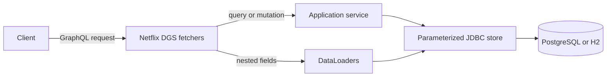

# Interview Manual: Spring DGS Applications

This project is a hands-on GraphQL learning sandbox built around a small job-application domain. Its purpose is to show how I approach an unfamiliar backend technology: start with a concrete domain, build a vertical slice, test the important behavior, and be explicit about what remains outside the scope of a demo.

Use the [live browser demo](https://rcrespo808.github.io/spring-dgs-applications/) for a quick visual walkthrough. Use the local Spring Boot app and GraphiQL when the discussion turns to Netflix DGS, SQL, migrations, batching, or tests.

## Honest introduction

Start with this:

> I have not used GraphQL in a production role yet. I built this focused sandbox to learn the parts that matter in a Java backend: schema-first design, queries and mutations, Netflix DGS fetchers, DataLoaders to avoid N+1 lookups, SQL persistence, validation, error handling, and integration tests. I would bring that foundation into production with the same care I use for Spring Boot services.

That statement is intentionally precise. The project is evidence of hands-on work and understanding, not a claim of production GraphQL operations.

## The problem it models

The API serves a simplified hiring workflow. A client can:

- browse jobs, candidates, and applications;
- submit one application for a candidate and job;
- read nested job and candidate data with an application;
- move an application through a controlled review process.

The sample identities are fictional. Jobs and candidates are read-only fixtures in this first version so the demo stays focused on GraphQL API behavior and application workflow rules.

## Architecture in one minute



The GraphQL schema is the public contract. DGS maps the schema to Java fetchers. The service owns state transitions and transaction boundaries. The JDBC store owns parameterized SQL. DataLoaders collect related IDs and fetch them in batches when nested GraphQL fields are requested.

## Five-minute demo script

The browser demo starts with local sample data and resets on reload. It executes the same schema with GraphQL.js, but it does not run the Java backend. Say that up front, then use it to demonstrate the API contract quickly.

### 1. Browse nested data

Select **Browse applications** and run it.

```graphql
query BrowseApplications {
  applications(limit: 20) {
    id
    status
    job { title company }
    candidate { name }
  }
}
```

Say:

> GraphQL lets the client request exactly the shape it needs. Here, an application includes only its selected job and candidate fields. In the Java backend, those nested relationships use DataLoaders so a page does not turn into one query per row.

Then remove `job` and `candidate` from the request and run it again. The response is smaller. In the Java test suite, this also proves no relationship lookups occur when callers do not select nested fields.

### 2. Create an application

Select **Apply to a job** and run it.

```graphql
mutation Apply {
  applyToJob(input: {
    jobId: "job-2"
    candidateId: "candidate-3"
  }) {
    id
    status
    job { title }
  }
}
```

Say:

> This mutation validates the input and confirms the referenced job and candidate exist. It writes inside a transaction. The database has a unique `(job_id, candidate_id)` constraint, so duplicate applications are prevented even if two requests arrive at once.

Run the same mutation again. The response returns `ALREADY_APPLIED`.

Say:

> The error code is stable enough for a client to act on. The server does not expose a raw SQL exception.

### 3. Explain the workflow rule

Reset the demo, then select **Review an application**.

```graphql
mutation Review {
  updateApplicationStatus(
    id: "application-1"
    status: REVIEWING
  ) { id status }
}
```

Say:

> The workflow allows `SUBMITTED -> REVIEWING -> INTERVIEW -> OFFERED`, with rejection from the active stages. `OFFERED` and `REJECTED` are terminal. This makes invalid state changes visible as application rules, not accidental database updates.

Select **Invalid transition** after moving the record to `REVIEWING`. The API returns `INVALID_TRANSITION` because it cannot jump to `OFFERED`.

### 4. Show query variables

Open **Variables**, replace the request with this, and run it:

```graphql
query InReview($status: ApplicationStatus) {
  applications(status: $status) {
    id
    status
    candidate { name }
  }
}
```

Use these variables:

```json
{ "status": "REVIEWING" }
```

Say:

> Variables separate the operation shape from runtime input. That makes requests reusable and avoids interpolating values into query strings.

### 5. Close with the backend evidence

Say:

> The public demo proves the API contract and interaction. The repository is where the backend concerns live: DGS fetchers, Flyway migrations, JDBC persistence, DataLoaders, transactions, and 11 integration tests run against both H2 and PostgreSQL.

## Concepts to explain clearly

| Concept | Plain explanation | Where it appears |
| --- | --- | --- |
| Schema-first GraphQL | The SDL defines operations, inputs, types, nullability and enums before implementation. It is the API contract. | [`applications.graphqls`](../src/main/resources/schema/applications.graphqls) |
| Query | A read operation whose caller selects fields. | `applications`, `jobs`, `candidates`, `application` |
| Mutation | A write operation. | `applyToJob`, `updateApplicationStatus` |
| Resolver/fetcher | Java code that fulfills a schema field. DGS maps annotated methods to fields. | [`ApplicationFetchers.java`](../src/main/java/dev/rcrespo/applications/ApplicationFetchers.java) |
| DataLoader | A request-scoped batcher for nested fields. It prevents the common N+1 lookup pattern. | [`JobLoader.java`](../src/main/java/dev/rcrespo/applications/JobLoader.java), [`CandidateLoader.java`](../src/main/java/dev/rcrespo/applications/CandidateLoader.java) |
| N+1 problem | Fetching applications is one query, then fetching each application’s job separately becomes N more queries. | Batch tests in [`ApplicationApiTest.java`](../src/test/java/dev/rcrespo/applications/ApplicationApiTest.java) |
| Flyway migration | Versioned database changes applied consistently when the service starts. | [`db/migration`](../src/main/resources/db/migration) |
| Transaction | A mutation’s database work succeeds or fails together. | [`ApplicationService.java`](../src/main/java/dev/rcrespo/applications/ApplicationService.java) |
| Optimistic update | A status update checks the previous value in SQL, so a stale request cannot overwrite a newer change. | `transition` in [`ApplicationStore.java`](../src/main/java/dev/rcrespo/applications/ApplicationStore.java) |
| GraphQL error extensions | A structured place for machine-readable business codes such as `ALREADY_APPLIED`. | [`GraphqlErrors.java`](../src/main/java/dev/rcrespo/applications/GraphqlErrors.java) |

## The DataLoader talking point

This is the most valuable GraphQL-specific concept in the project.

When the client requests `applications { job { title } }`, a straightforward implementation might fetch applications once and then fetch each job separately. With 20 applications, that can become 21 database queries. The DataLoader gathers job IDs requested during the GraphQL operation and calls one batch query using `WHERE id IN (...)`.

For the seeded two-application query, both applications share `job-1`. The test verifies that the Java backend invokes the job batch lookup once with the de-duplicated ID and the candidate batch lookup once with both IDs. The result ordering comes from the DataLoader key mapping, not database row order.

Be accurate about the boundary:

> The batching guarantee is for this relationship within one application page and operation. It is not a blanket performance guarantee for arbitrary GraphQL queries, aliases, or unbounded result sets.

## Important design decisions

### Nullability and errors

`application(id: ID!): Application` is nullable because a missing ID is an ordinary lookup result. Mutation results are also nullable: a business error can return at that field while GraphQL returns a structured `errors` array. Required IDs and inputs are non-null in the schema, so GraphQL validation rejects malformed requests before resolver logic runs.

### Database constraints as a second line of defense

The service checks for sensible input and references, but application code alone cannot reliably stop concurrent duplicates. The unique database constraint is authoritative. The mutation converts the resulting duplicate-key failure into `ALREADY_APPLIED`.

### Controlled state transitions

Status rules belong in the service, not in the UI. The API accepts only valid next states. The SQL update also includes the previous status in its `WHERE` clause, which prevents a stale client from overwriting a newer change.

### Pagination tradeoff

This demo uses bounded offset/limit pagination to keep the API small and easy to inspect. Results are ordered deterministically by ID. Production systems with a large or changing dataset would usually move to cursor pagination and add creation timestamps or another business ordering field.

## Questions an interviewer may ask

### Why GraphQL instead of REST?

> It is useful when different clients need different views of connected data and over-fetching or under-fetching becomes costly. It does not replace REST automatically. For a narrow, stable command endpoint, REST may be simpler. I would choose based on client needs, ownership, caching, observability, and team familiarity.

### Is DGS still relevant now that Spring has GraphQL support?

> DGS is now built on Spring GraphQL and remains a good fit where its annotations, DataLoader integration, testing support, or an existing DGS codebase are useful. I picked it because the role specifically mentions Netflix DGS. The core concepts here transfer to Spring GraphQL: schema design, fetchers, batching, validation, and operational guardrails.

### How would you secure this in production?

> Add authentication, candidate and recruiter authorization rules, field-level privacy where appropriate, audit logs, secure secrets management, rate limits, query depth and complexity limits, persisted queries where useful, and observability. I would also ensure candidate data is minimized and protected according to the product’s requirements.

### How would you make it production-ready?

> First, I would decide the identity and authorization model. Then add cursor pagination, query complexity limits, tracing and metrics, structured audit events, integration tests for authorization, and deployment configuration. I would test expected query shapes under realistic data volume before making claims about throughput.

### Why use JDBC instead of JPA?

> The API has a small number of explicit queries, so JDBC makes the SQL and batching behavior easy to see. JPA would be reasonable in a larger domain, but GraphQL fetch patterns still need careful control to avoid accidental lazy-loading and N+1 behavior.

### What is the difference between the live demo and the backend?

> The GitHub Pages demo runs the same GraphQL schema in the browser with local sample data. It exists to make the contract easy to explore. The Spring Boot backend runs DGS, JDBC, Flyway, transactions, and DataLoaders locally or in Docker; that behavior is verified in the repository tests.

### How did AI participate?

> I used AI as an implementation and learning aid, then reviewed the design, wrote and ran the tests, and can explain the decisions and limits. I do not present generated code as production experience. The relevant standard is whether I understand and can own what is in the repository.

## What not to overclaim

Do not describe this as production GraphQL experience. Do not say that the GitHub Pages demo is deployed Spring Boot, or that it proves throughput, AWS proficiency, MongoDB experience, federation, subscriptions, authentication, or production monitoring.

Instead say:

> It is a focused technical showcase. It proves that I can build and reason about the core GraphQL patterns in the role’s stack, and it shows how I would close the remaining production-context gap quickly and honestly.

## Before the interview

1. Open the [live demo](https://rcrespo808.github.io/spring-dgs-applications/) in a browser and use **Reset** before showing mutations.
2. Keep the [repository](https://github.com/rcrespo808/spring-dgs-applications) open on the README and this manual.
3. If you can run the API locally, start it with `docker compose up --build -d` and open [GraphiQL](http://localhost:8080/graphiql).
4. Practice the five-minute script once without reading it. Aim to explain the choices, not narrate every file.
5. Be ready to discuss the next production increment: authorization, cursor pagination, complexity limits, tracing, and real deployment.

## Useful repository paths

| Purpose | Path |
| --- | --- |
| API contract | [`src/main/resources/schema/applications.graphqls`](../src/main/resources/schema/applications.graphqls) |
| DGS fetchers | [`src/main/java/dev/rcrespo/applications/ApplicationFetchers.java`](../src/main/java/dev/rcrespo/applications/ApplicationFetchers.java) |
| DataLoaders | [`src/main/java/dev/rcrespo/applications/JobLoader.java`](../src/main/java/dev/rcrespo/applications/JobLoader.java) and [`CandidateLoader.java`](../src/main/java/dev/rcrespo/applications/CandidateLoader.java) |
| Business rules | [`src/main/java/dev/rcrespo/applications/ApplicationService.java`](../src/main/java/dev/rcrespo/applications/ApplicationService.java) |
| SQL and migrations | [`src/main/resources/db/migration`](../src/main/resources/db/migration) |
| Error mapping | [`src/main/java/dev/rcrespo/applications/GraphqlErrors.java`](../src/main/java/dev/rcrespo/applications/GraphqlErrors.java) |
| Integration tests | [`src/test/java/dev/rcrespo/applications/ApplicationApiTest.java`](../src/test/java/dev/rcrespo/applications/ApplicationApiTest.java) |
